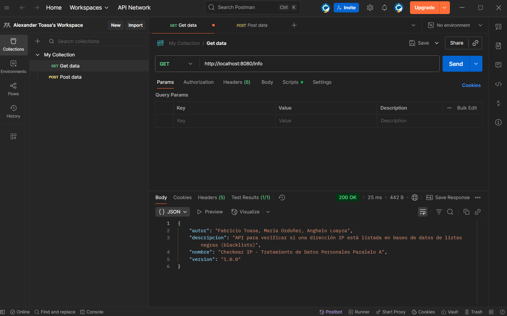

# API PARA VERIFICAR SI UNA IP ESTÁ EN UNA LISTA NEGRA (BLACKLISTS)

## 1. 📌 DESCRIPCIÓN

API desarrollada en **Python** usando **Flask** para verificar si una dirección IP se encuentra en una lista negra simulada (blacklist).

Esta API permite:

- Consultar si una IP está en una **lista negra simulada**.
- Obtener información básica de la API como nombre, versión y autores.
- Servir como base para integrar servicios externos en futuras versiones. 

## 2. ⚙️ PREREQUISITOS

Antes de ejecutar la API localmente, asegúrate de tener instalado:

- [Python 3.10+](https://www.python.org/downloads/)
- pip (gestor de paquetes de Python)
- Flask

Instalar Flask:

```bash
pip install Flask
```
## 3. 🐳 Cómo ejecutar con Docker

Construir la imagen Docker
```bash
docker build -t flask-check-ip .
```


Ejecutar el Contenedor
```bash
docker run -d -p 8080:8080 --name check-ip-api flask-check-ip
```


## 4. Probar los endpoints dentro del Docker

1️⃣ /info

Obtiene información básica de la API.

```bash
curl "http://localhost:8080/info"
```
```json
{
  "nombre": "Checkear IP - Tratamiento de Datos Personales Paralelo A",
  "version": "1.0.0",
  "descripcion": "API para verificar si una dirección IP está listada en bases de datos de listas negras (blacklists)",
  "autor": "Fabricio Toasa, Maria Ordoñez, Anghelo Loayza"
}
```

2️⃣ /check-ip

Verifica si una IP está en la lista negra simulada.

Ejemplo 1 – IP listada:

```bash
curl "http://localhost:8080/check-ip?ip=192.168.1.100"
```
```json
{
  "details": {
    "reason": "Malware distribution",
    "severity": "High"
  },
  "status": "listed"
}
```

Ejemplo 2 – IP no listada:

```bash
curl "http://localhost:8080/check-ip?ip=8.8.8.8"
```
```json
{
  "details": "La IP no está en la lista negra.",
  "status": "not_listed"
}
```

Ejemplo 3 – IP con formato inválido:

```bash
curl "http://localhost:8080/check-ip?ip=abc.def.ghi.jkl"
```
```json
{
  "error": "Formato de IP inválido"
}
```

Ejemplo 4 – Sin IP:
```bash
curl "http://localhost:8080/check-ip"
```
```json
{
  "error": "Proporciona una dirección IP"
}
```

## 5. Pruebas en Postman

**Postman** es una herramienta para probar, documentar y automatizar APIs de manera sencilla.

```bash
http://localhost:8080/check-ip?ip=192.168.1.100
```


Fig. 3.- Peticion GET desde postman al endpoint check-ip.

```bash
http://localhost:8080/info
```



Fig. 4.- Peticion GET desde postman al endpoint info.

## 5. Códigos de peticiones en Docker


Fig. 5.- Resultados de Peticiones GET en Docker.

