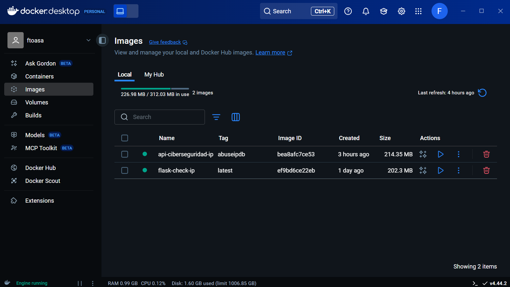
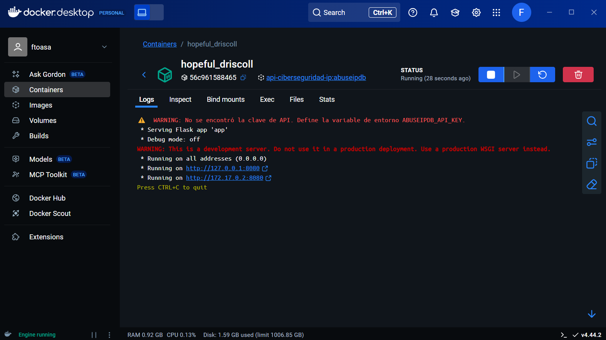
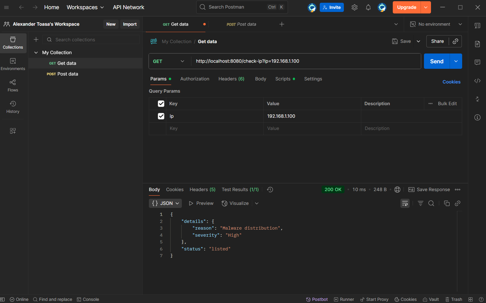
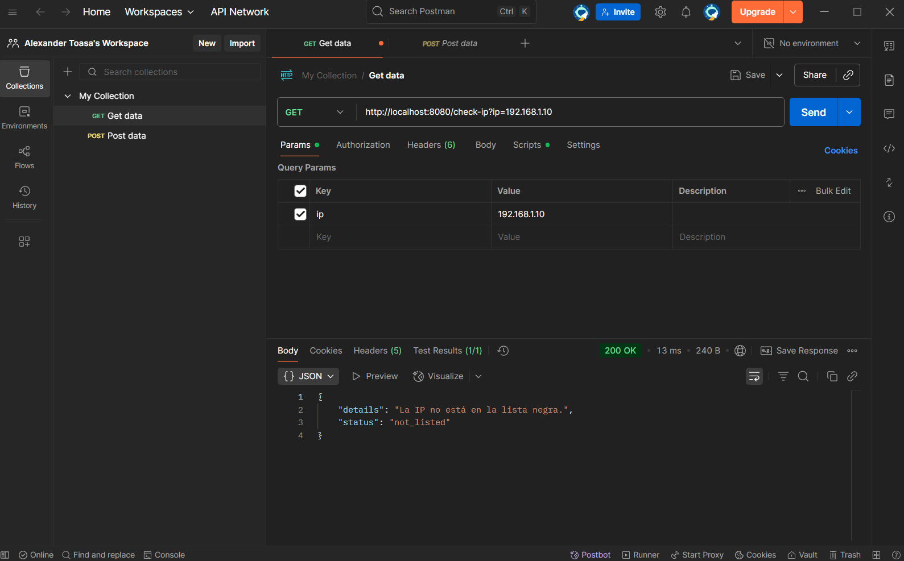
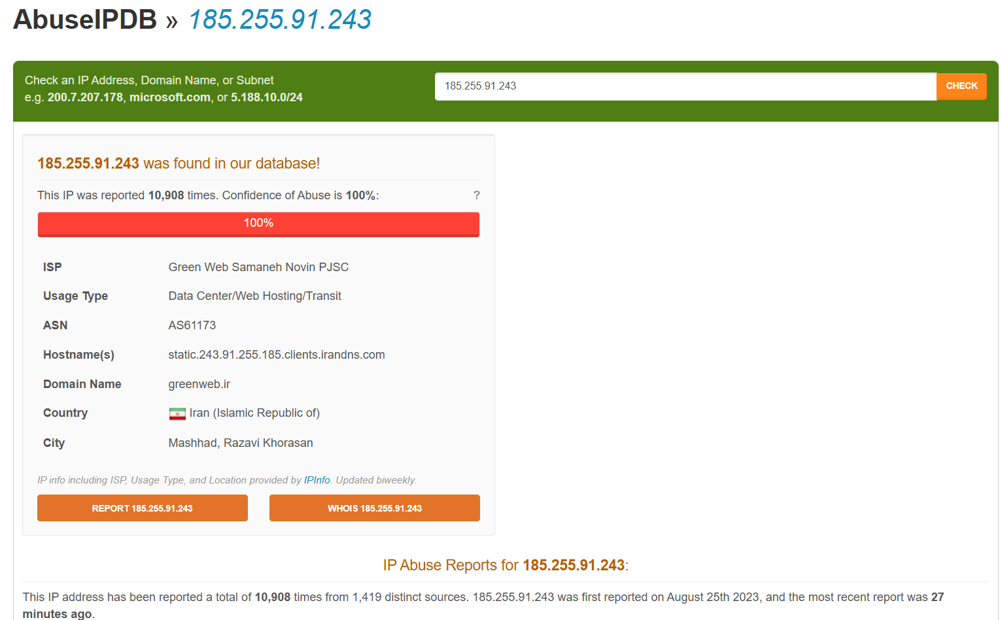
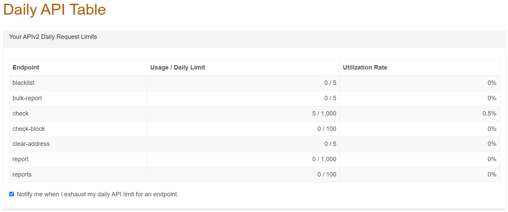

# API PARA VERIFICAR SI UNA IP ESTÁ EN UNA LISTA NEGRA (BLACKLISTS)

## 1. 📌 DESCRIPCIÓN

API sencilla desarrollada en **Python** usando **Flask** para verificar si una dirección IP se encuentra en una lista negra simulada (blacklist).

Esta API permite:

- Consultar si una IP está en una **lista negra simulada**.
- Obtener información básica de la API como nombre, versión y autores.
- Servir como base para integrar servicios externos en futuras versiones. 

## 2. ⚙️ PREREQUISITOS

Antes de ejecutar la API localmente, asegúrate de tener instalado:

- [Python 3.10+](https://www.python.org/downloads/)
- pip (gestor de paquetes de Python)
- Flask

Instalar Flask:

```bash
pip install Flask
```
## 3. 🐳 Cómo ejecutar con Docker

Construir la imagen Docker
```bash
docker build -t flask-check-ip .
```


Ejecutar el Contenedor
```bash
docker run -d -p 8080:8080 --name check-ip-api flask-check-ip
```


## 3. INSTALACIÓN

Construir imagen Docker

```bash
docker build -t api-ciberseguridad-ip:abuseipdb .
```

Ejecutar el contenedor con la API Key

```bash
docker run -d -p 8080:8080 -e ABUSEIPDB_API_KEY="tu_api_key" --name abuseipdb-api api-ciberseguridad-ip:abuseipdb
```

## PRUEBAS

### 3.1. Despliegue contenedor en Docker


Fig. 1.- Construir Imagen Docker



Fig. 2.- Ejecutar Docker con la API Key

### 3.2. Pruebas con curl

Para realizar peticiones HTTP utilizamos curl desde la linea de comandos, curl es ampliamente utilizado para probar APIs ya que simula lo que haria un navegador o un cliente externo.

**Pruebas endpoint /check-ip.**
Ejecutamos curl con una IP maliciosa almacenada en nuestra base de datos local y obtenemos la respuesta.

```bash
curl "http://localhost:8080/check-ip?ip=192.168.1.100"
```
Respuesta en Formato Json de la IP 192.168.1.100, la direccion IP se encuentra listada en una Blacklist

```json 
{"details":{
    "reason":"Malware distribution",
    "severity":"High"},
    "status":"listed"
    }
```
Ejecutamos curl con una IP cualquiera y obtenemos la respuesta.

```bash
curl "http://localhost:8080/check-ip?ip=192.168.1.10"
```
Respuesta en formato Json, la dirección IP no se encuentra listada en una Blacklist

```json 
{"details":"La IP no está en la lista negra.",
"status":"not_listed"}
```

**Pruebas endpoint check-abuseipdb** 

```bash
curl "http://localhost:8080/check-abuseipdb?ip=185.255.91.243"
```

```json
{"details":{
    "abuseConfidenceScore":100,
    "countryCode":"IR",
    "lastReportedAt":"2025-08-19T02:54:03+00:00",
    "totalReports":4148},
    "status":"listed"}
```

**Pruebas endpoint /info.**

```bash
curl "http://localhost:8080/info"
```
```json
{
  "autor": "Fabricio Toasa, Maria Ordoñez, Anghelo Loayza",
  "descripcion": "API para verificar si una dirección IP está listada en bases de datos de listas negras (blacklists)",
  "nombre": "Checkear IP - Tratamiento de Datos Personales Paralelo A",
  "version": "1.0.1"
}
```

### 3.3. Pruebas en Postman

**Postman** es una herramienta para probar, documentar y automatizar APIs de manera sencilla.

```bash
http://localhost:8080/check-abuseipdb?ip=185.255.91.243
```



Fig. 3.- Peticion GET desde postman al endpoint check-abuseipdb.

```bash
http://localhost:8080/check-ip?ip=192.168.1.10
```



Fig. 4.- Peticion GET desde postman al endpoint check-ip.

```bash
http://localhost:8080/info
```


Fig. 5.- Peticion GET desde postman al endpoint info.

### 3.4. Pruebas desde la página AbuseIPDB



Fig. 6.- Información de una IP Maliciosa desde AbuseIPDB.



Fig. 7.- Reporte de uso del API.

